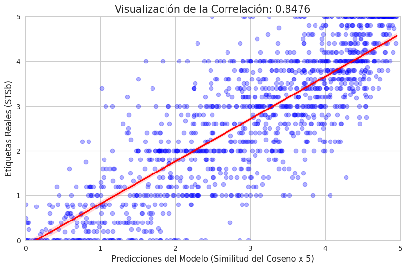

# 🚀 Semantic Similarity with Bi-Encoders (Fine-tuning DistilRoBERTa)

Este proyecto desarrolla un sistema de **similitud semántica de textos (STS)** utilizando arquitecturas Transformer avanzadas. El objetivo es ajustar un modelo de regresión capaz de cuantificar la relación entre frases en una escala de 0 (sin similitud) a 5 (identidad semántica).

## 📋 Descripción del Proyecto
Se ha implementado un enfoque de **Bi-Encoder** mediante la librería `sentence-transformers`. A diferencia de los modelos pre-entrenados estándar, este proyecto incluye un proceso de **fine-tuning** específico para optimizar la representación del espacio vectorial[cite: 14].

### Características Técnicas:
* **Arquitectura:** Bi-Encoder basado en `distilroberta-base`.
* **Dataset:** [STSbenchmark](https://huggingface.co/datasets/mteb/stsbenchmark-sts).
* **Función de Pérdida:** `CosineSimilarityLoss`.
* **Métrica Principal:** Correlación de Pearson.


## 📊 Evaluación y Métricas
Se ha demostrado la eficacia del modelo comparando dos configuraciones de entrenamiento, evaluando cada modelo implementado.

| Configuración | Épocas | Correlación de Pearson (Test) |
| :--- | :---: | :---: |
| Experimento 1: Baseline | 1 | 0.8307 |
| **Experimento 2: Optimizado** | **4** | **0.8477** |

### Visualización de Resultados
La siguiente gráfica muestra la correlación entre las etiquetas reales del dataset STSb y las predicciones generadas por el modelo final.

 
*(Nota: Asegúrate de que el archivo 'descarga.png' esté en la raíz de tu repositorio)*


## 🧪 Demostración Final (Out-of-sample)
Se presentan 6 pares de frases originales (no contenidas en el dataset) para verificar la capacidad de generalización del modelo en todos los niveles de similitud:

| Frase A | Frase B | Predicción (0-5) |
| :--- | :--- | :---: |
| A man is playing the piano. | A man plays the piano. | **4.85** |
| A man is eating food. | A man is eating a meal. | **4.15** |
| A man is cutting an apple. | A man is slicing a vegetable. | **2.62** |
| A man is walking through the woods. | A man is walking on the beach. | **2.23** |
| A man is cooking. | A man is sleeping. | **1.21** |
| The sky is blue. | The stock market crashed. | **0.33** |

## ⚙️ Instalación
Para replicar este entorno de Deep Learning para NLP:

```bash
pip install sentence-transformers datasets pandas matplotlib seaborn scipy
